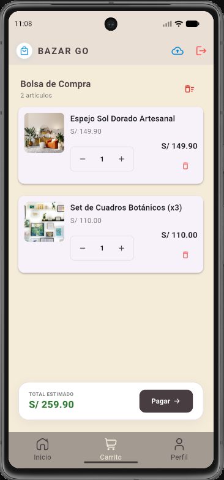
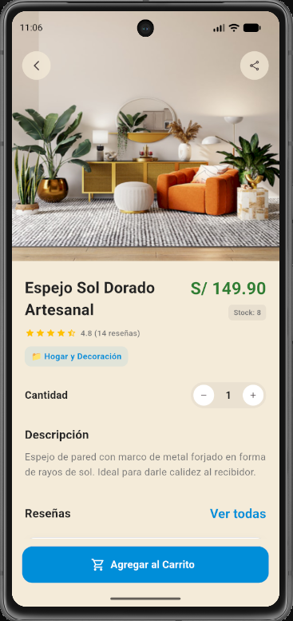
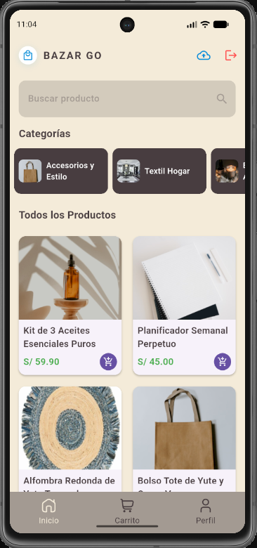

# TiendaApp - Aplicación de E-commerce con Flutter

Proyecto de aplicación móvil de comercio electrónico desarrollado con **Flutter** y **Riverpod** para la gestión de estado. Esta aplicación permite a los usuarios explorar productos, categorizarlos, gestionar un carrito de compras y realizar pedidos.

## 🚀 Características Principales

* **Gestión de Estado:** Implementación robusta con `flutter_riverpod`.
* **Catálogo en Tiempo Real:** Carga de productos desde Firebase Firestore.
* **Carrito de Compras:** Funcionalidades de añadir, actualizar cantidades, eliminar y vaciar carrito.
* **Interfaz Fluida:** Uso de `CustomScrollView` y `SliverGrid` para un rendimiento optimizado.
* **Experiencia de Usuario:** Pull-to-refresh para actualizar productos manualmente.
* **Navegación:** Gestión de estados de pantalla integrada.

## 🛠 Tecnologías Utilizadas

* **Framework:** Flutter
* **Gestión de Estado:** Riverpod
* **Backend / DB:** Firebase (Firestore & Storage)
* **Diseño:** UI personalizada con colores definidos y componentes reutilizables.

## 📸 Capturas de Pantalla





## ⚙️ Configuración del Entorno

Para ejecutar este proyecto, asegúrate de tener instalado [Flutter](https://flutter.dev/docs/get-started/install).

1. Clona el repositorio:
   ```bash
   git clone https://github.com/juans-code/tienda_app.git
